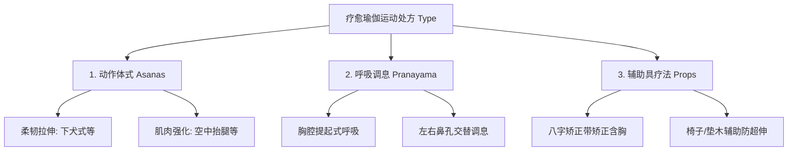

# 疗愈瑜伽运动处方与干预应用指南 (ACSM 对齐版)

本指南严格遵循 **ACSM（美国运动医学会）FITT-VP 运动处方体系**，将疗愈瑜伽的经典体式、呼吸调息、功法技术及辅助工具填充其中。旨在为疗愈瑜伽智能体提供一套具有科学剂量控制与极致理疗效果的运动处方生成规范。

---

## 一、 ACSM FITT-VP 疗愈瑜伽剂量控制架构

根据 ACSM 运动处方一般原则，瑜伽作为一种集心肺、抗阻、柔韧与神经肌肉平衡于一体的综合性“身心运动（Mind-Body Exercise）”，其剂量控制如下：

### 1.1 F - Frequency (频率)
- **有氧辅助**：每周 **3–5 天**（配合原地慢跑、快走等，激活心肺以促进微循环，参考 [《肩颈痛疗愈瑜伽》第三章37页](chapter3/page_037.md)）。
- **理疗体式与抗阻强化**：每周 **2–3 天** 进行系统的针对性肌肉强化（如腹肌、背肌及肩胛骨稳定性训练）。
- **柔韧拉伸与调息**：每周 **≥2–3 天**，推荐**每天练习**。日常规律拉伸可获得最佳关节活动度改善。

### 1.2 I - Intensity (强度)
- **拉伸柔韧强度**：遵循瑜伽书的**「渐进量力」原则**（参考 [《Judy 瑜伽疗愈》前言14页](chapter0/page_014.md)）。拉伸至目标肌群有“轻微牵拉感或微紧感”，但**必须完全处于无痛（No Pain）范围**。
- **心脏负荷强度**：中等强度心肺负荷，控制靶心率在 **40%–59% HRR**（心率储备）内，主观疲劳感觉（RPE 6–20 标度法）维持在 **11–13 分（轻松至微累）** 的舒适区间。

### 1.3 T - Time (时间)
- **单次总时长**：每次课程控制在 **30–60 分钟**。
- **单体式保持时间**：每个静态拉伸体式应保持 **30–60 秒**。在瑜伽实操中，这等同于保持 **5–10 次深长缓慢的自然呼吸**。

### 1.4 T - Type (运动类型)
融合疗愈瑜伽的三大核心技术组件，实施差异化处方：

### 1.5 V - Volume (总量)
- **有氧运动总量**：每周达到 **500–1000 MET-min·wk⁻¹**。
- **拉伸总量**：每个目标肌群拉伸时间累计达到 **60 秒**，可通过重复多组（例如每次拉伸 20 秒，重复 3 组）来达成。

### 1.6 P - Progression (进展与调整)
- 遵循**渐进性原则**，在受试者适应当前动作且无痛的前提下，通过以下方式进行安全进展：
  1. 延长动作保持的呼吸次数（由 5 次递增至 10 次）。
  2. 逐渐降低对辅助工具（如瑜伽砖高度）的依赖，增强自主神经肌肉控制。
  3. 由被动牵伸过渡到主动肌肉控制下的拉伸。

---

## 二、 疗愈瑜伽三大核心组件与技术索引

根据“剂量依 ACSM，技术依瑜伽书”的原则，以下是智能体可直接调用的疗愈瑜伽核心干预技术表：

### 2.1 疗愈体式动作 (Asanas)
对齐 ACSM 的抗阻强化与柔韧柔和性训练：

| 动作类型 | 体式技术要领 | 典型体式与理疗原理 | 瑜伽知识库源链接 |
| :--- | :--- | :--- | :--- |
| **有氧配合** | 原地慢跑激活微循环 | 伸展胸大肌开胸后，配合原地慢跑让体温上升、心肺加速，再回到静态伸展，使紧绷的肌筋膜先恢复弹性。 | [《肩颈痛疗愈瑜伽》第三章37页](chapter3/page_037.md) |
| **柔韧拉伸** | 下犬式脊椎拉伸 | **原理**：有效拉伸后侧链筋膜，建立肩胛骨稳定性，观察并纠正“过硬”或“过度柔软”者的体态偏差。 | [《肩颈痛疗愈瑜伽》第二章25页](chapter2/page_025.md) |
| **柔韧拉伸** | 胸大肌与胸锁乳突肌拉伸 | **原理**：放松耸肩紧绷的肩颈肌群（上斜方肌），恢复肩胛骨在胸廓上的移动自由，矫正含胸驼背。 | [《肩颈痛疗愈瑜伽》第七章17页](chapter7/page_017.md) |
| **肌肉强化** | 空中抬腿下腹强化 | **原理**：强化深层腹直肌与腹外斜肌，为腰椎提供强有力的腹压支持，保护下背部。 | [《Judy 瑜伽疗愈》第一章36页](chapter1/page_036.md) |

### 2.2 呼吸调息技术 (Pranayama)
对齐 ACSM 神经生理调控与肺活量通气储备（BR）优化：

| 调息类型 | 呼吸技术要领 | 理疗生理机制 | 瑜伽知识库源链接 |
| :--- | :--- | :--- | :--- |
| **胸腔呼吸** | 外肋间肌提起式深吸气 | 启动外肋间肌，深吸气时横向提起肋骨以扩大肺部，提升肺腔利用率，解决“呼吸浅表、吸不到气”的问题。 | [《Judy 瑜伽疗愈》第四章27页](chapter4/page_027.md) |
| **神经调控** | 左右鼻孔交替呼吸法 | 调节植物神经平衡。左鼻孔主导吸气可降低交感神经张力、平抚情绪；右鼻孔主导吸气可激活交感、提升活力。适用于鼻孔呼吸不均与呼吸不畅。 | [《Judy 瑜伽疗愈》第四章33页](chapter4/page_033.md) |

### 2.3 辅助工具理疗 (Props & Alignments)
对齐 ACSM 运动进展期（Progression）的安全保护与防代偿机制：

| 辅具类型 | 理疗辅助使用方法 | 矫正与代偿预防机制 | 瑜伽知识库源链接 |
| :--- | :--- | :--- | :--- |
| **八字矫正带** | 肩臂套入八字带或弹力带 | **强制纠偏**：物理锁定肩胛骨下沉与外展状态，被动纠正长期用电脑电脑桌低头产生的含胸圆背，在此基础上进行胸椎侧伸展。 | [《肩颈痛疗愈瑜伽》第四章18页](chapter4/page_018.md) |
| **椅子辅助** | 椅子支撑坐位前屈/后弯 | 针对柔韧性极差、老年人群（ACSM 老年运动指南对齐），避免直接前屈对下背部或椎间盘产生过高剪切力，利用椅子降低负荷。 | [《Judy 瑜伽疗愈》第七章37页](chapter7/page_037.md) |

---

## 三、 特殊人群疗愈瑜伽处方指引与安全红线

智能体在针对特殊慢性病人群制定处方时，必须强制包含以下 ACSM 安全禁忌对齐逻辑：

### 3.1 高血压人群 (Hypertension)
- **ACSM 剂量规范**：中等强度有氧运动（40%–59% VO₂R / RPE 12–13），每天进行。
- **瑜伽红线约束**：
  - **严禁倒立与长时间屏气（呼吸暂停/悬息）**：倒转体式（如头倒立、肩倒立）和瓦萨瓦动作（屏气用力）会引起颅内压暴增，诱发脑溢血。
  - **渐进进展**：只有在空中抬腿测试通过、且实测血压控制在正常升高区间内（<130/80 mmHg）时，才能在专业指导下缓慢尝试初级倒转（如靠墙辅助半倒转，且时间不超过 15 秒）。

### 3.2 骨质疏松人群 (Osteoporosis)
- **ACSM 剂量规范**：承重运动与负重抗阻，强化平衡训练防止跌倒（ACSM 跌倒预防对齐）。
- **瑜伽红线约束**：
  - **严禁过度前屈与剧烈旋转脊柱**：骨质疏松患者的椎体极其脆弱，过度前弯（如直腿防雨前屈式）会给椎体前侧施加巨大的挤压应力，极易导致脊椎压迫性骨折。
  - **处方推荐**：推荐进行温和的仰卧开胸、利用辅助带的温和脊柱拉伸，配合静态单腿平衡体式（防止跌倒测试，对齐 [《肩颈痛疗愈瑜伽》第二章28页](chapter2/page_028.md) 的一分钟骨松评估建议）。

### 3.3 慢性肩颈痛与脊椎错位人群 (Cervical Spine & Shoulder Pain)
- **ACSM 剂量规范**：改善肩颈动力链的柔韧性，同时强化核心与中下斜方肌耐力，纠正力学代偿。
- **瑜伽红线约束**：
  - **严禁代偿耸肩与颈椎过直过度挤压**：在做抬手动作时，若上斜方肌本就严重痉挛（榕树根化），必须首先通过按摩放锁胸锁乳突肌、前斜角肌，严禁带代偿耸肩的重阻力上举。
  - **防反转反噬**：在核心肌力（空中抬腿）和肩胛骨承托力不足前，严禁练习反转式（如肩倒立），避免重力全部压在脆弱的颈椎上，导致生理弯曲“颈椎过直”。
