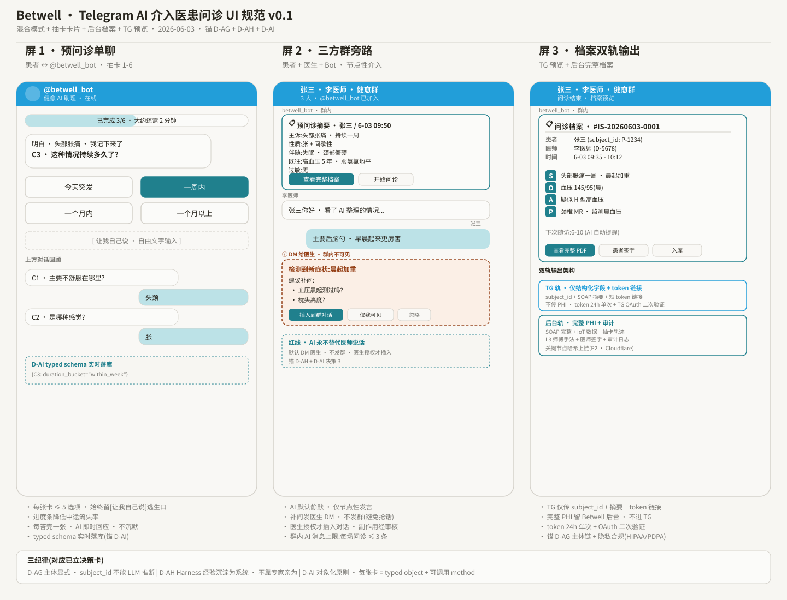

# 疗愈瑜伽 · 抽卡问诊 UI 规范

**版本**：v0.1（2026-06-03 草案 · 落地前最终方案待评审）
**适用范围**：疗愈瑜伽问诊（L2a 度假村疗愈场景，28 天连续陪伴）
**关联决策卡**：D-AG · D-AH · D-AI
**原始来源**：[`wileyfan/betwell-docs/foundations/specs/betwell-telegram-ai-consultation-ui-v0.1.md`](https://github.com/wileyfan/betwell-docs/blob/main/foundations/specs/betwell-telegram-ai-consultation-ui-v0.1.md)

---

## 0 · 一图速览

> 完整 SVG：[`assets/betwell_tg_ai_consultation_ui.svg`](./assets/betwell_tg_ai_consultation_ui.svg)

**核心模式**：**混合模式 + 抽卡卡片 + 后台档案 + TG 预览**

- **混合模式** = 患者先与 AI bot 单聊完成预问诊 → 再进医患三方群与医生对话 · AI 继续在群里抽卡补漏
- **抽卡卡片** = 每次给患者 1-3 张预设问题卡 · Inline Keyboard 点选 · 不是自由打字
- **后台档案** = 完整 SOAP + IoT + 抽卡轨迹存 Betwell 后台数据库 · 不传 TG
- **TG 预览** = TG 内只发结构化摘要 + 查看完整档案链接（带 token）

---

## 1 · 三屏布局

| 屏 | 主题 | 角色 | 抽卡用法 |
|---|---|---|---|
| **屏 1 · 预问诊单聊** | 患者 ↔ `@betwell_bot` | 单聊 · 抽 1-6 张卡 | C1 → C2 → C3 … 递进式问诊，每张卡 ≤5 选项 + "让我自己说"逃生口 |
| **屏 2 · 三方群旁路** | 患者 + 医生 + Bot · 节点性介入 | DM 给医生 · 群内不可见 | AI 默认静默，仅节点性发言；红线：AI 永不替代医师说话 |
| **屏 3 · 档案双轨输出** | 问诊结束 · 档案预览 | TG 预览 + 后台完整档案 | SOAP（S/O/A/P）结构化 + token 链接 |

### 1.1 屏 1 · 预问诊单聊（患者 ↔ Bot）

- 进度条："已完成 3/6 · 大约还需 2 分钟"
- 当前问题以卡片形式呈现，≤5 个选项按钮 + 一行"让我自己说，自由文字输入"逃生口
- 上方滚动展示已答对话：`C1：主要不舒服在哪里 → 头颈`、`C2：是哪种感觉 → 胀`
- 每答完一张，AI 即时回应，不沉默
- **typed schema 实时落库**：例 `{C3: duration_bucket="within_week"}`（锚 D-AI）

### 1.2 屏 2 · 三方群旁路（患者 + 医生 + Bot）

- 群消息流：Bot 先发**预问诊摘要**（主诉、性质、伴随、既往、过敏）+ "查看完整档案" / "开始问诊" 按钮
- 医生与患者自然对话
- AI 检测到新症状（如"晨起加重"）→ **仅 DM 给医生**，群内不可见
  - 卡片建议："建议补问：血压晨起测过吗？ / 枕头高度？"
  - 操作按钮：`[插入到群对话]` / `[仅我可见]` / `[忽略]`
- 红线：**AI 永不替代医师说话**。默认 DM 医生、不发群；医生授权后插入对话；锚 D-AH + D-AI 决策 3

### 1.3 屏 3 · 档案双轨输出（问诊结束）

**TG 预览卡**（结构化摘要 + token）：
- 问诊档案 ID（例 `#IS-20260603-0001`）
- 患者 `subject_id: P-1234`、医师 `D-5678`、时间段
- SOAP 摘要：
  - **S** 头部胀痛一周，晨起加重
  - **O** 血压 145/95（晨）
  - **A** 疑似 H 型高血压
  - **P** 颈椎 MR · 监测晨血压
- 下次随访日期 + 操作按钮：`[查看完整 PDF]` `[患者签字]` `[入库]`

**双轨输出架构**：

| 轨 | 内容 | 安全 |
|---|---|---|
| **TG 轨** | `subject_id + SOAP 摘要 + 短 token 链接` | 不传 PHI · token 24 h 单次 · TG OAuth 二次验证 |
| **后台轨** | 完整 PHI · SOAP 完整 · IoT 数据 · 抽卡轨迹 · L3 师傅手法 · 医师签字 · 审计日志 | 关键节点哈希上链（P2 · Cloudflare） |

---

## 2 · 三纪律（对应已立决策卡）

| 锚 | 一句话 | 落地意味 |
|---|---|---|
| **D-AG · 主体显式** | `subject_id` **不能** LLM 推断 | 必须显式传入；schema 用正则 `^P-[0-9]{4,}$` 强约束 |
| **D-AH · Harness 沉淀** | 经验沉淀**为系统**，不靠专家亲为 | Harness workflow 可调用此 schema；6 张固定卡组先做 MVP |
| **D-AI · 对象化原则** | 每张卡 = **typed object + 可调用 method** | 字段 / 类型 / 必填性显式；LLM 输出必须可被 method 调用 |

---

## 3 · 关键规则一览

### 屏 1（预问诊单聊）

- 每张卡 ≤ 5 选项，始终留"让我自己说"逃生口
- 进度条降低中途流失率
- 每答完一张，AI 即时回应，不沉默
- typed schema 实时落库（锚 D-AI）

### 屏 2（三方群旁路）

- AI 默认静默，仅节点性发言
- 补问发医生 DM，不发群（避免抢话）
- 医生授权才插入对话，副作用经审核
- 群内 AI 消息上限：每场问诊 ≤ 3 条

### 屏 3（档案双轨输出）

- TG 仅传 `subject_id + 摘要 + token 链接`
- 完整 PHI 留 Betwell 后台，不进 TG
- token 24 h 单次 + OAuth 二次验证
- 锚 D-AG 主体链 + 隐私合规（HIPAA / PDPA）

---

## 4 · 相关文件

| 文件 | 用途 |
|---|---|
| [`assets/betwell_tg_ai_consultation_ui.svg`](./assets/betwell_tg_ai_consultation_ui.svg) | 三屏 UI 线框图（v0.1） |
| [`betwell-telegram-ai-consultation-ui-v0.1.md`](./betwell-telegram-ai-consultation-ui-v0.1.md) | 完整设计规范（流程图 / 抽卡详情 / 边界条件） |
| [`intake-card-typed-schema.json`](./intake-card-typed-schema.json) | 6 张固定卡组的 JSON Schema（D-AI 落地） |

---

## 5 · 与本仓库其它模块的关系

- **`disciplines/therapeutic-yoga/agents/assessment/`** — 问诊智能体直接消费 `intake-card-typed-schema.json`，输出落入后台档案
- **`platform/schemas/profile_schema.json`** — 问诊产出的 SOAP / 主诉字段映射到统一受测者画像
- **`platform/knowledge_base/acsm/`** — `A`（评估）阶段引用 ACSM 规则给出禁忌与适配建议

---

## 6 · 来源与版本

- **原始仓库**：`wileyfan/betwell-docs`
- **原始路径**：`foundations/specs/`
- **同步日期**：2026-06-12
- **同步方式**：纯复制（无 git history），见 `PORTING_NOTES.md`
- **后续更新**：以本仓库副本为准；如 betwell-docs 原文有新版本，由 wileyfan 决定何时同步
